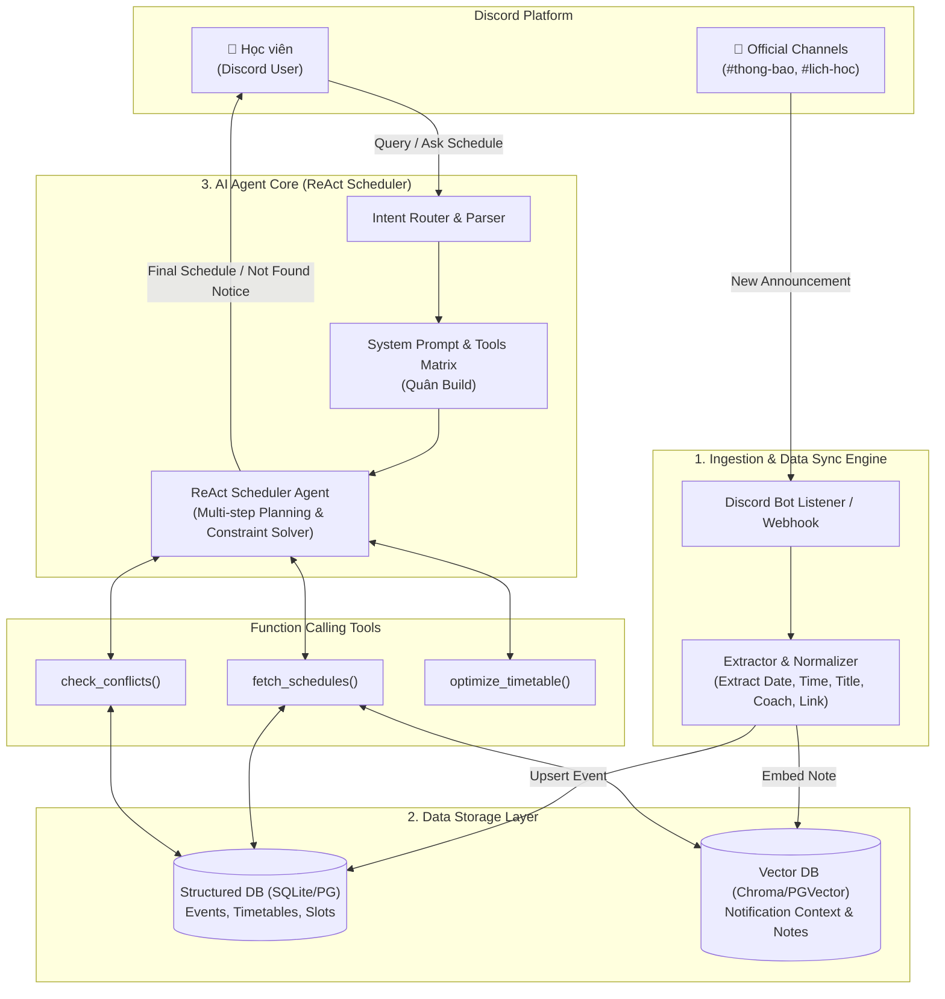
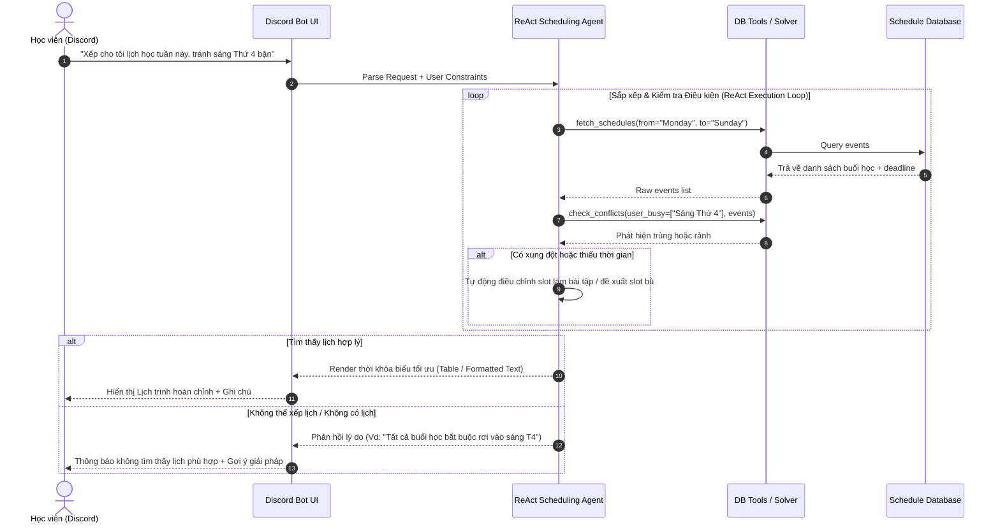

# KIẾN TRÚC DỰ ÁN: TRỢ LÝ AI QUẢN LÝ & SẮP XẾP LỊCH TRÌNH HỌC VIÊN (DISCORD AI SCHEDULE ASSISTANT)

> **Dự án**: Hackathon Batch 03 - Hướng B: Trợ lý Học viên (Discord)  
> **Tên đề tài**: Trợ lý AI Tự Động Trích Xuất, Truy Xuất & Sắp Xếp Lịch Trình Từ Thông Báo Discord  
> **Nhóm thực hiện**: Thắng (Khảo sát) | Tín + Hùng (Thiết kế & Build Engine/Bot) | Quân (Prompt Engineering)

---

## 1. Bối cảnh & Bằng chứng Khảo sát (Problem & Evidence)

- **Bối cảnh**: Học viên phải tiếp nhận lượng lớn thông báo lịch học, lịch nộp bài, lịch mentorship, thay đổi giờ đột xuất từ nhiều kênh trên Discord (`#thong-bao`, `#lich-hoc`, `#mentoring`...).
- **Pain point (Khủng hoảng thông tin)**: Lịch trình dày đặc, thay đổi liên tục. Học viên dễ bỏ lỡ lịch, xếp trùng lịch hoặc mất nhiều thời gian tra cứu thủ công và liên tục phải ping hỏi Giảng viên / Coach.
- **Kết quả khảo sát (Thắng thực hiện)**:
  - Khảo sát **>20 học viên**.
  - **>60% học viên** xác nhận gặp khó khăn nghiêm trọng trong việc tìm kiếm, tổng hợp và tự lên kế hoạch tuần/tháng.
  - Hậu quả: Tốn thời gian cá nhân và gây nhiễu kênh chat chung khi hỏi lại lịch.

---

## 2. Lát cắt Sản phẩm (Core Product Slice)

> **Format lát cắt**: *Một học viên · Một việc (Hỏi/Nhờ xếp lịch) · Một quyết định AI (Query DB & Lặp sắp xếp lịch tối ưu) · Một kết quả (Thời khóa biểu không trùng / Phản hồi không có lịch).*

- **Trải nghiệm chính**:
  1. Học viên gõ lệnh/nhắn tin trên Discord: *"AI xếp cho tôi lịch học và thời gian làm bài tập tuần này sao cho không trùng với lịch cá nhân 14h-16h T3"* hoặc *"Tối nay có lịch gì không?"*.
  2. AI Agent kích hoạt quy trình ReAct: Truy xuất Database thông báo -> Đối soát khoảng rảnh/trùng -> Lập lịch trình cá nhân hóa.
  3. AI lặp lại quá trình tìm kiếm & tính toán đến khi đưa ra lịch hoàn chỉnh hoặc phản hồi rõ ràng nếu khoảng thời gian đó không thể xếp lịch.

---

## 3. Kiến trúc Tổng quan Hệ thống (System Architecture)

Hệ thống bao gồm 4 tầng chính: **Interface Tier**, **Ingestion Pipeline**, **AI Agent Engine**, và **Data Storage Tier**.



---

## 4. Luồng Xử Lý Chi Tiết (Detailed Sequence & Workflow)

### 4.1. Luồng Tự Động Ingest & Đồng Bộ Thông Báo Discord
1. Ban tổ chức / Giảng viên đăng thông báo mới trên kênh Discord.
2. **Ingestion Engine** nhận event, gửi qua LLM Extractor để chuẩn hóa thành dữ liệu có cấu trúc:
   ```json
   {
     "event_id": "evt_20260730_01",
     "title": "Buổi Mentoring Chấm CP2",
     "start_time": "2026-07-30T17:00:00+07:00",
     "end_time": "2026-07-30T18:00:00+07:00",
     "type": "MANDATORY",
     "speaker": "Coach Hùng",
     "channel": "Discord Voice 1",
     "raw_text": "Thông báo: 17h hôm nay chốt CP2 tại Voice 1..."
   }
   ```
3. Lưu dữ liệu đã cấu trúc vào **Schedule DB** và vector hóa nội dung vào **Vector DB**.

### 4.2. Luồng Sắp Xếp Lịch Tự Động Với Agentic Loop (ReAct)



---

## 5. Thiết Kế Cơ Sở Dữ Liệu (Database Schema Design)

### 5.1. Bảng `official_schedules` (Lịch chính thức từ Discord)
| Column Name | Type | Description |
|---|---|---|
| `id` | VARCHAR(50) | Primary Key (VD: `SCH_001`) |
| `title` | TEXT | Tên sự kiện / buổi học / deadline |
| `start_time` | DATETIME | Thời gian bắt đầu |
| `end_time` | DATETIME | Thời gian kết thúc |
| `is_mandatory` | BOOLEAN | Bắt buộc tham gia hay tùy chọn |
| `category` | VARCHAR(30) | `CLASS`, `DEADLINE`, `MENTORING`, `WORKSHOP` |
| `host` | VARCHAR(100) | Giảng viên / Coach phụ trách |
| `location` | TEXT | Link Meet hoặc tên Discord Channel |
| `source_msg_id` | VARCHAR(50) | Discord Message ID để trích dẫn gốc |
| `created_at` | DATETIME | Thời điểm sync từ Discord |

### 5.2. Bảng `student_personal_slots` (Lịch bận cá nhân học viên)
| Column Name | Type | Description |
|---|---|---|
| `user_id` | VARCHAR(50) | Discord User ID |
| `busy_start` | DATETIME | Thời gian bắt đầu bận |
| `busy_end` | DATETIME | Thời gian kết thúc bận |
| `reason` | TEXT | Ghi chú lịch cá nhân (Vd: "Bận việc công ty") |

---

## 6. Phân Tích 4 Lớp Chỗ Khó & Kịch Bản Rủi Ro (Risk Matrix)

| Lớp chỗ khó | Kịch bản rủi ro | Giải pháp xử lý |
|---|---|---|
| **① Nguồn sự thật (Source of Truth)** | AI bịa ra lịch học không có trong thông báo Discord. | Ràng buộc AI **chỉ** dùng data từ `official_schedules`. Mọi câu trả lời phải đính kèm link/trích dẫn thông báo gốc trên Discord. |
| **② Mơ hồ / Thiếu thông tin** | Học viên hỏi: *"Chiều nay có học không?"* nhưng không cung cấp thông tin lớp/khóa. | Agent kích hoạt prompt hỏi lại (Low-confidence pathway) để xác nhận khóa học/lớp của học viên trước khi truy xuất DB. |
| **③ Ngoài phạm vi / Thẩm quyền** | Học viên yêu cầu: *"Dời lịch học lớp sang ngày mai giúp tôi"*. | AI từ chối lịch sự, giải thích không có thẩm quyền thay đổi lịch chung và hướng dẫn contact Admin/Giảng viên. |
| **④ Đặc thù Domain (Overridden Schedule)** | Thông báo mới đè lên thông báo cũ (Vd: *"Dời buổi học T3 sang T5"*). | Ingestion Engine cập nhật trạng thái `is_overridden = True` cho tin nhắn cũ, Agent ưu tiên phiên bản mới nhất (`updated_at`). |

---

## 7. Phân Công Nhân Sự (Team Work Breakdown Structure)

| Thành viên | Vai trò chính | Nhiệm vụ chi tiết trong dự án | Deliverables |
|---|---|---|---|
| **Thắng** | **User Research & Evidence** | - Thực hiện khảo sát 20+ học viên về nỗi đau khủng hoảng lịch.<br/>- Tổng hợp & phân tích số liệu (>60% gặp khó khăn).<br/>- Thu thập quote thực tế & làm báo cáo Evidence (§1 Spec). | `validation/survey_log.md`<br/>Section §1, §2 trong Spec |
| **Tín + Hùng** | **System Architecture & Build Engine** | - Thiết kế & triển khai Discord Bot Interfacer.<br/>- Build Ingestion Pipeline (Sync Discord -> Structured DB).<br/>- Xây dựng DB Schema & Vector Index.<br/>- Lập trình AI Agent Core & Function Calling Tool Matrix. | `codebase/bot/`<br/>`codebase/engine/`<br/>`codebase/db/`<br/>`ARCHITECTURE.md` |
| **Quân** | **Prompt Engineering & AI Behavior** | - Thiết kế System Prompt cho ReAct Scheduler Agent.<br/>- Xây dựng JSON Schema cho Function Calling Tools.<br/>- Cấu hình Guardrails chống ảo giác (Hallucination) & xử lý 4 lớp chỗ khó.<br/>- Xây dựng Golden Set 20+ testcases để eval. | `codebase/prompts/`<br/>`eval/golden_set.json`<br/>Section §5, §6, §7 trong Spec |

---

## 8. Kiểm Thử & Tiêu Chí Chất Lượng (Eval & Quality Bar)

- **Golden Set (Quân biên soạn)**: 20+ kịch bản (Trùng lịch, Đổi lịch đột xuất, Hỏi chung chung, Đòi dời lịch chung...).
- **Quality Bar**:
  - **100%** câu trả lời về lịch bắt buộc phải có `source_msg_id` trích dẫn từ Discord.
  - **0%** chấp nhận ảo giác lịch trình (False Positive Schedule).
  - **≥ 90%** gợi ý sắp xếp lịch trình chính xác không trùng với lịch bận cá nhân của học viên.
